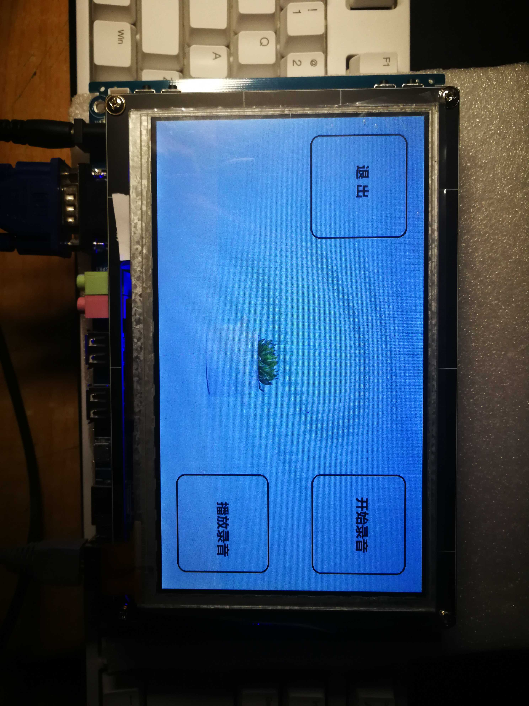
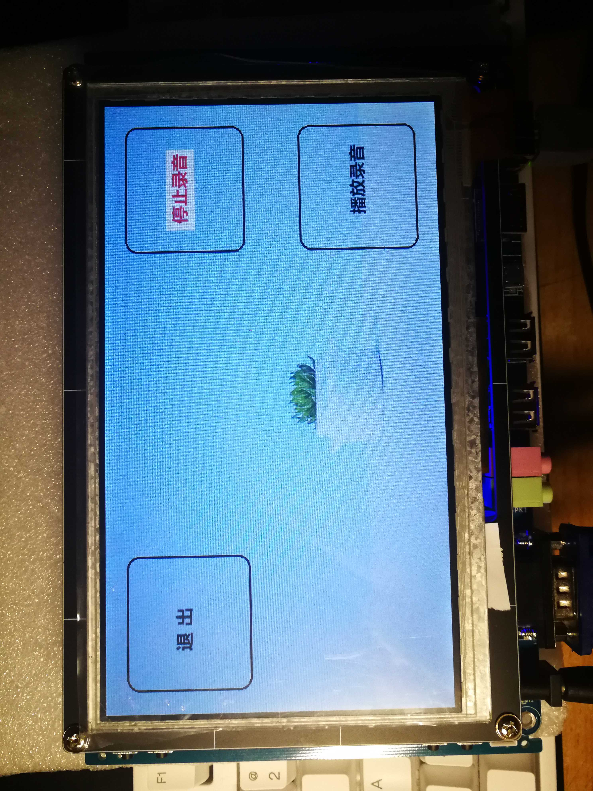
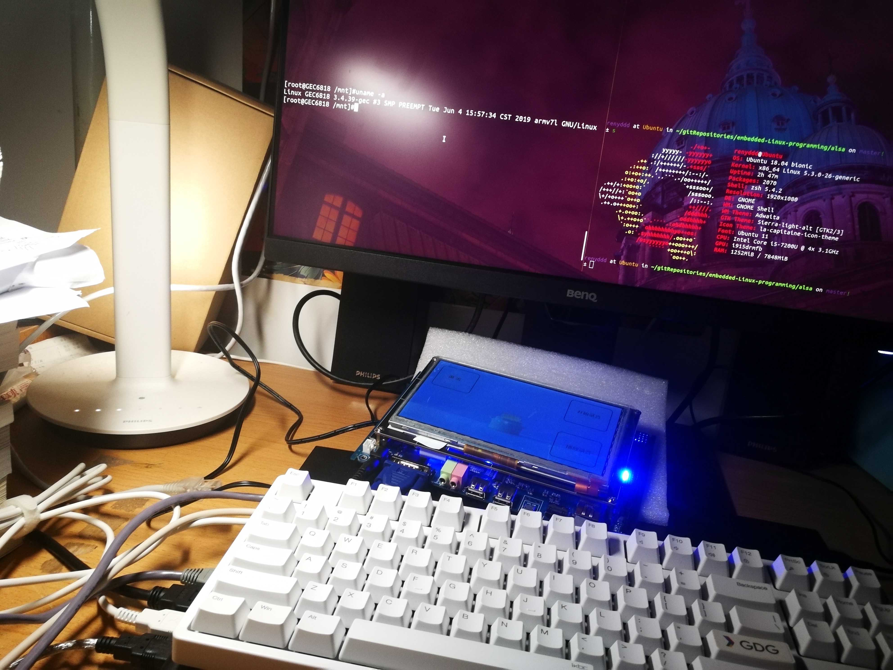

# Linux 编程

[文件 IO](https://github.com/renyddd/embedded-Linux-programming/tree/master/fileIO)

[进程编程 fork() and exec()](https://github.com/renyddd/embedded-Linux-programming/tree/master/processDir)

[socket 网络编程](https://github.com/renyddd/embedded-Linux-programming/tree/master/socketDir)

[alsa 录音](https://github.com/renyddd/embedded-Linux-programming/tree/master/alsa)

# 数据结构源码

[数据结构](https://github.com/renyddd/embedded-Linux-programming/tree/master/dataStructure)

